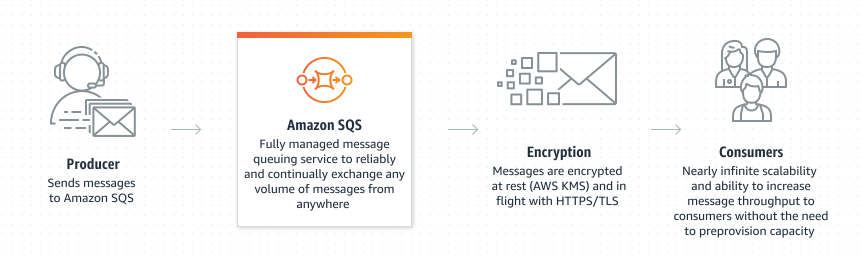
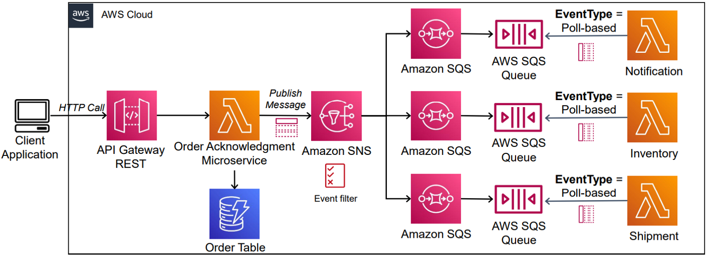

# Queues on software design

**Queues** are systems designeds to receive a message, store it and deliver it to consumers in a asychronous way.
<p>Exemples of queues systems: RabbitMQ, SQS, Kafka, Redis Streams, ActiveMQ, Google Pub/Sub.</p>

### Why use queues?
1. **Scalability**: Can absorve picos sem quebrar
2. **Decoubling**: Can decouple
3. **Integrity**: Messages don't get lost.
4. **Performance**: Respostas rápidas ao usuário

#### Dictionary
- **FIFO**: First in, first out (most common)
- **Buffer**: Absorbs traffic spikes
- **Asynchronous**: API responds quickly, processing happens later
- **Fan-Out**: A multi-action event (SNS + SQS)
- **Resilience**: Automatic retry + Dead Letter Queue (DLQ)

### Major Services
- **SQS** (AWS): Fila gerenciada, pull-based
- **SNS** (AWS): Pub/Sub, push-based
- **RabbitMQ**: Open source, flexível
- **Kafka**: Alta performance, streaming

## Types of Queues

### 1. FIFO (First In, First Out)
**Most common type** - The first item in is processed first

```
Input: A → B → C → D
Output: A → B → C → D
```

### 2. Priority Queue
Messages with **high priority** are processed first

```
Input: [Low] [High] [Medium] [High]
Output: [High] [High] [Medium] [Low]
```

### 3. LIFO (Last In, First Out)
**Rarely used** in distributed systems - Last in, first out

Input: A → B → C → D
Output: D → C → B → A

## SQS



## SNS
AWS SNS (Simple Notification Service) is a fully managed messaging service for application-to-application and application-to-person communication

## SNS and SQS

When to use:

### When SQS:
* Need to process tasks in the background
* want to control processing speed
* need automatic retry
* A single consumer must process the message

### When SNS:
* need to notify multiple systems
* want event broadcasting
* need immediate delivery
* Different consumers need to react to the same event

### Example of usage



### Sources
- https://aws.amazon.com/pt/sns/
- https://en.wikipedia.org/wiki/Amazon_Simple_Queue_Service
- https://aws.amazon.com/pt/sqs/
- https://www.youtube.com/watch?v=jeiQvHctlng
- https://www.youtube.com/watch?v=ac2zC2YsXnI
- https://www.youtube.com/watch?v=BTjxUS_PylA
